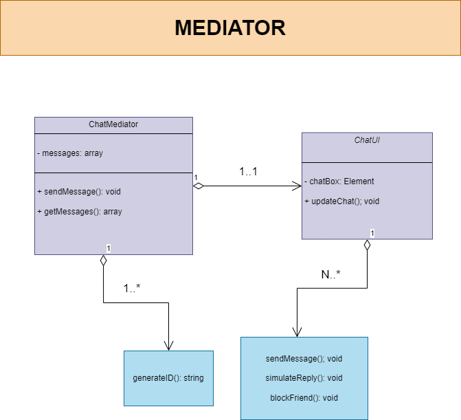

# <p align="center">Mediator Pattern</p>
<p align="center"></p>

O padrão Mediator é um padrão comportamental que promove o desacoplamento entre componentes de um sistema, permitindo que eles interajam entre si de forma organizada e indireta, através de um objeto mediador central.

## Introdução

O padrão Mediator é útil em situações onde um conjunto de objetos precisa se comunicar de maneira complexa, mas sem que eles próprios estejam fortemente acoplados. Isso é alcançado ao centralizar as interações complexas em um objeto mediador, permitindo que os objetos comuniquem-se de forma indireta, através dele.

## Quando usar o padrão Mediator?

O padrão Mediator é útil em casos em que:

- O comportamento entre objetos se torna complexo e difícil de entender devido a múltiplas interações diretas.
- Há muitas dependências entre objetos, levando a um alto acoplamento.
- A adição de novos componentes tende a aumentar a complexidade do sistema.

## Diagrama de classes:
<div align="center"></div>

## Implementação em JavaScript

```javascript
// Mediator pattern implementation

const ChatMediator = (function() {
    let messages = [];
    return {
        sendMessage: function(sender, message) {
            messages.push({ id: generateId(), sender, message });
            ChatUI.updateChat();
        },
        getMessages: function() {
            return messages;
        }
    };
})();
function generateId() {
    return '_' + Math.random().toString(36).substr(2, 9);
}

// UI controller

const ChatUI = (function() {
    const chatBox = document.getElementById('chat-box');
    return {
        updateChat: function() {
            chatBox.innerHTML = ''; 
            ChatMediator.getMessages().forEach(({ id, sender, message }) => {
                const messageElement = document.createElement('div');
                messageElement.textContent = `${sender}: ${message}`;
                messageElement.classList.add('message');
                messageElement.dataset.messageId = id;
                if (sender === ' Leticia') {
                    messageElement.classList.add('amiga-message');
                } else if (sender === ' Carla') {
                    messageElement.classList.add('amiga-message2');
                } else {
                    messageElement.classList.add('mediator-message');
                }
                chatBox.appendChild(messageElement);
            });
        }
    };
})();
function sendMessage() {
    const userInput = document.getElementById('user-input');
    const message = userInput.value.trim();
    if (message !== '') {
        ChatMediator.sendMessage(' Leticia', message);
        simulateReply(message);
        userInput.value = '';
    }
}
function simulateReply(message) {
    let replyMessage = '';
    if (message.toLowerCase() === 'oi') {
        replyMessage = 'Oi! Tudo bem?';
    } else if (message.toLowerCase() === 'oi tudo bem?') {
        replyMessage = 'Oi! Estou bem e você?';
    } else if (message.toLowerCase() === 'q bom') {
        replyMessage = 'Mensagem bloqueada.';
        blockFriend(); 
    } else {
        replyMessage = 'Desculpe, não entendi. Poderia repetir?';
    }
    setTimeout(() => {
        ChatMediator.sendMessage(' Carla', replyMessage);
    }, 2000);
    startTimer();
}
let timer;
function startTimer() {
    clearTimeout(timer);
    timer = setTimeout(() => {
        console.log("Tempo esgotado! Leticia bloqueada.");
        blockFriend(); 
    }, 5000);
}
function blockFriend() {
    const replyMessage = 'Neste código minha função é facilitar a comunicação entre vocês, gerenciando  suas trocas de mensagens,  garantindo que cada mensagem seja destribuida para o outro indiretamente, sendo assim mais flexivel.';
    ChatMediator.sendMessage('Mediator', replyMessage);
}
document.getElementById('user-input').addEventListener('keypress', function(event) {
    if (event.key === 'Enter') {
        sendMessage();
    }
});
ChatUI.updateChat();
```

## Explicação do Código

- **Implementação do Padrão Mediator:** 
  - O código JavaScript implementa o padrão Mediator para gerenciar a comunicação entre os participantes do chat.
  - `ChatMediator` atua como o objeto mediador central, responsável por coordenar a troca de mensagens entre os participantes.
  - Cada mensagem enviada é armazenada em um array `messages`, permitindo que o `ChatUI` atualize dinamicamente o chat com as novas mensagens.

- **UI Controller (ChatUI):** 
  - `ChatUI` é responsável por atualizar dinamicamente a interface do chat com as novas mensagens.
  - Ele acessa o array de mensagens do `ChatMediator`, cria elementos HTML para representar cada mensagem e os adiciona ao DOM.

- **Envio e Recebimento de Mensagens:**
  - Quando um usuário envia uma mensagem, o `ChatMediator` é notificado e adiciona a mensagem ao array de mensagens.
  - O `ChatUI` é então atualizado para exibir a nova mensagem na interface do usuário.
  - O mediador simula uma resposta automaticamente após dois segundos, utilizando a função `simulateReply`.

- **Alerta e Timeout:**
  - O sistema simula o alerta de um usuário e um timeout caso a resposta demore mais de cinco segundos para chegar.
  - Se uma mensagem específica for enviada, o sistema responde com uma mensagem de alerta.

- **Event Listeners:**
  - Um event listener é adicionado ao campo de entrada de texto para enviar mensagens quando a tecla Enter é pressionada.

- **Atualização Inicial do Chat:**
  - Ao carregar a página, o `ChatUI` é inicialmente atualizado para exibir todas as mensagens existentes no array de mensagens do `ChatMediator`.

## Autores

Projeto feito por Leticia e Carla, contendo uma breve explicação sobre patterns mediator, onde você encontra um diagrama de classe e um código demonstrativo

- GitHub = [@lehhofman](https://www.github.com/lehhofman) & [@Carla-coder](https://www.github.com/Carla-coder)
